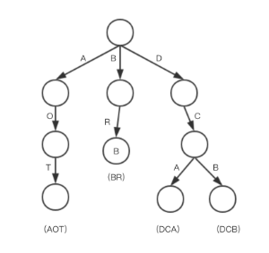
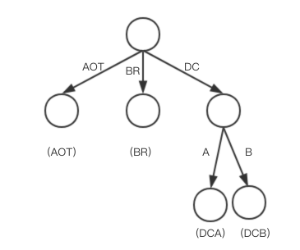
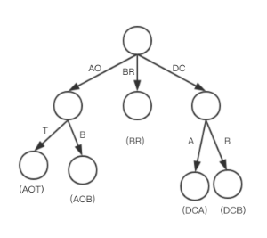
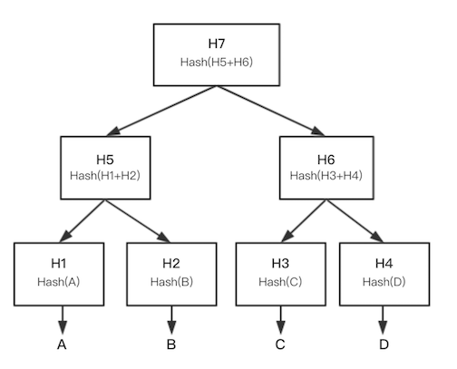
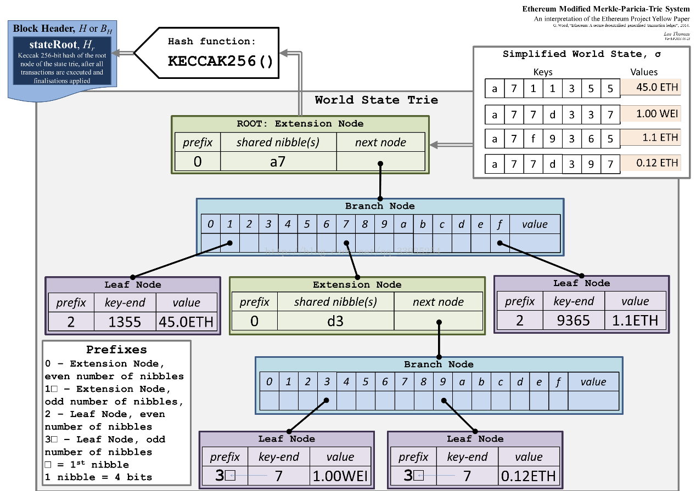

# research report on MPT

以太坊账本的数据结构是区块链列表，是区块链的原始数据结构。如今，还推导出了一些其他数据结构，例如DAG（有向无环图）。在以太坊中，挖矿是生成区块的一种方式，“挖矿”区块的权利是每个节点通过PoW机制获得公平竞争。每个区块中包含的数据在以太坊白皮书中有定义，交易列表包含在这些数据中。交易列表由以太坊中称为MPT（Merkle Patricia Tree）的数据结构表示。MPT是由Trie Tree和Merkle Tree进化而来的，因此它具有两者的特点。

## Trie Tree

为了更好地了解MPT，我们应该首先了解Trie Tree。Trie Tree是一种字典树，下图是Trie Tree的结构：

上面的 Trie 树表示 [“AOT”、“BR”、“DCA”、“DCB”] 的字符串集合，从根节点到叶节点的路径表示字符串集合的元素。例如，最左边的路径表示“AOT”。Trie Tree 组织键值对也有好处。Key 是由从根节点到叶节点的路径表示的字符串，值被放置或通过叶节点中的指针指向值。按键搜索值具有恒定级别的时间复杂性。

## Patricia Tree

为了节省以太坊的空间，实际上使用优化的Trie树，Patricia Trie（压缩前缀树），如下所示：

在Trie Tree的基础上，Patricia Trie将子节点与只有一个子节点的父节点合并。优点是它更节省空间。但是，缺点是插入时它比Trie树稍微复杂一些。在某些情况下，有必要做节点分割，例如，如果在上面的树结构中插入一个字符串“AOB”，那么节点“AOT”将被拆分为两个节点“AO”和“T”，树结构将如下图所示：

## Merkle Tree

另一种数据结构是Merkle Tree，这是区块链的重要数据结构，已应用于SPV（简化支付验证）

Merkle Tree也被称为Hash Tree，一种二叉树。此树的每个节点都存储哈希值，并且只有叶节点包含的数据如上面显示的 [A、B、C、D] 一样。叶节点的值来自对其关联数据的哈希计算，而父节点的值来自两个子节点的串联哈希字符串的哈希。哈希过程在每个节点上以递归方式重复，直到计算出根节点的哈希。因此，在Merkle树中，每当任何叶节点发生更改时，根节点哈希都会相应地更改，这被称为其最重要的特征。

## Merkle Patricia Tree

由于Patricia Trie具有简单的结构并且易于搜索，并且Merkle Tree支持零知识证明，因此MPT是通过优化Patricia Trie和Merkle Tree来发展的，具有两者的优点。下图显示了MPT结构：

MPT实际上是一个Patricia Trie，很容易存储键值数据集。同时它具有Merkle Tree的功能，通过递归找出ROOT，任何节点内容的变化都会导致ROOT的变化。

以太坊源代码显示MPT中的ROOT计算与Merkle树中的ROOT计算非常相似。在DFS 遍历期间，根据遇到的与叶节点关联的数据计算数据哈希，其中数据对象序列化为二进制数组，然后对二进制数组进行哈希处理。分支节点上的哈希处理过程是将指针替换为子节点的哈希值，然后将其序列化为二进制数组以进行哈希处理。扩展节点具有与分支节点相同的哈希进程。DFS完成后，生成每个节点（包括根节点）的哈希值。一旦树中的任何节点更改了数据内容，就不必遍历ROOT值的所有节点，而只需重新计算从节点到根节点及其同级节点的路径中每个节点的哈希值即可。

MPT在以太坊中被广泛使用。交易清单，收据清单，世界状况和合同数据均由MPT构建。

以世界状态为例，表示为键值集结构。关键是帐户地址，值是一个4元组值：[nonce，balance，storageRoot，codeHash]。在以太坊中，世界状态在整个网络中存储整个网络中所有帐户的状态消息一段时间。当交易发生或智能合约运行时，帐户的状态可能会发生变化。MPT 用于帮助生成新的哈希值，在状态更改期间计算更少。此外，只要存在可靠的ROOT，就可以快速验证来自不受信任来源的帐户状态。此外，MPT本质上是Patricia Trie，因此可以按地址快速搜索帐户状态。多亏了MPT，以太坊节点能够只在区块头中存储交易列表ROOT、接收列表ROOT、世界状态ROOT和合约数据ROOT，并分别存储或传输详细的数据信息和区块头，使轻量级节点成为可能。

综上所述，MPT在存储键值数据方面具有独特的优势

- search-in-ease
- incremental root hash calculation
- zero-knowledge proof 