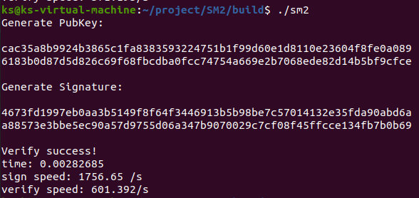

# SM2 RFC6979

依靠RFC6979标准实现了SM2算法


## 算法标准

SM2的曲线方程为
$$
y^2=x^3+ax+b
$$


其中：

- a ：0xFFFFFFFEFFFFFFFFFFFFFFFFFFFFFFFFFFFFFFFF00000000FFFFFFFFFFFFFFFC
- b ：0x28E9FA9E9D9F5E344D5A9E4BCF6509A7F39789F515AB8F92DDBCBD414D940E93
- p ：0xFFFFFFFEFFFFFFFFFFFFFFFFFFFFFFFFFFFFFFFF00000000FFFFFFFFFFFFFFFF

私钥长度：32字节。

公钥长度：SM2非压缩公钥格式字节串长度为65字节，压缩格式长度为33字节，若公钥y坐标最后一位为0，则首字节为`0x02`，否则为`0x03`。非压缩格式公钥首字节为0x04

签名长度：64字节


### 签名算法流程

1. 置M' = ZA || M M为待签名数据 ZA为A的可辨识标识、部分椭圆曲线系统参数和用户A的公钥的Hash值
2. 计算e = Hash(M') 并将其转化为整数
3. 用随机数发生器生成随机数k (k>1 k< n-1) n 椭圆曲线的阶数 可以通过G计算出
4. 计算椭圆曲线点(x1,y1) = [k]G，并将其转化为整数 G为椭圆上一点 [k]G指椭圆乘法k倍G
5. 计算r= (e + x1)mod n，若r=0或r+k=n返回（三）
6. 计算s= ((1+da) ^(-1) * (k-r*da))mod n，若s=0则返回（三） da为用户A的私钥
7. 将r、s数据类型转化成字节串，消息M的签名为(r,s)

### 验签算法流程

1. 验证r>1 r<n-1
2. 验证s>1 s<n-1
3. 置M' = ZA || M
4. 计算e = Hash(M') 并将其转化为整数
5. 将r s数据类型转换为整数 计算 t= (r+s)mod n ，若t=0则验证不通过
6. 计算椭圆曲线点(x1,y1) = [s]G + [t]Pa Pa为A的公钥
7. 将x1的数据类型转换成整数，计算R=(e+x1)mod n，验证R=r，成立则验证通过

## 文件介绍

#### sm3.h sm3.cpp

自主实现的SM3算法，来作为算法的HASH

#### miracl.h mirdef.h

miracl库头文件

#### SM2_sign .h SM2_sign .cpp

##### SM2_init()

对椭圆曲线参数进行初始化

##### isInRange(big num)

判断num是否在有限域内

##### SM2_creat_key

生成密钥对

##### SM2_ZA

生成可辨识标识

##### SM2_sign

生成签名

##### SM2_verify

验证签名


## 运行效率

签名速度 1756.65  次/s

验签速度 601.392次/s




## 运行指导

#### dependencis

MIRACl库

#### 编译

```
mkdir build&&cd build
cmake ..
make 
```

