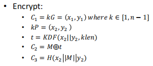
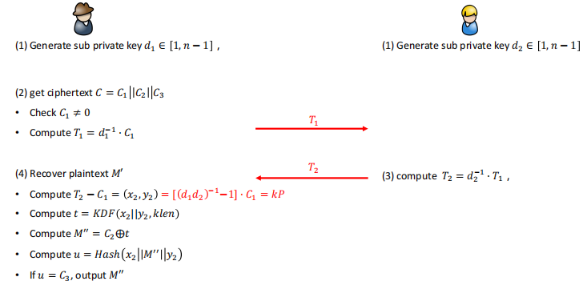
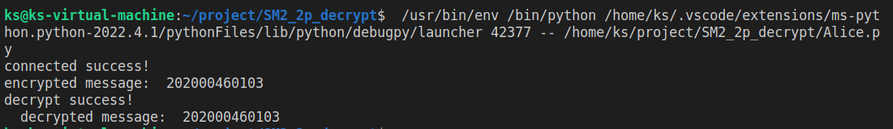
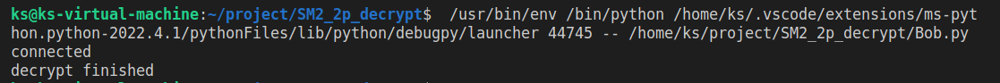

# implement sm2 2P decrypt with real network communication

## 文件说明

#### ecc.py

实现了椭圆曲线的基本算法（基于SM2），重载了相关运算符

#### ALIce.py Bob.py

使用socket完成真实网络的模拟

#### encypt.py

实现了SM2加密过程

#### KDF.py

实现了KDF(KDF1)

## 算法过程

#### 加密

#### 解密

## 运行结果

#### Alice

#### Bob

## 运行指导

先执行Bob.py  再执行Alice.py