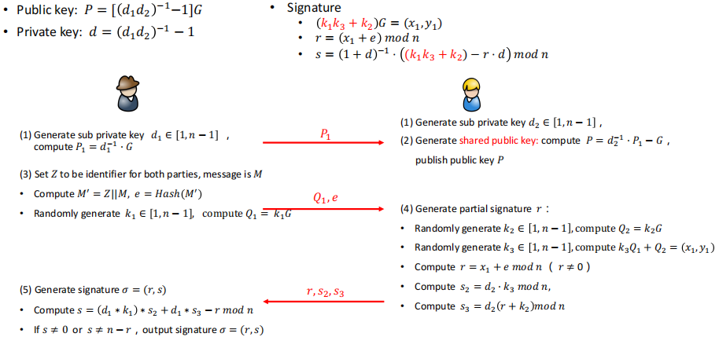
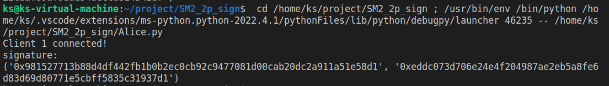
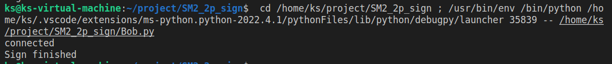

# implement sm2 2P sign with real network communication

## 文件说明

#### ecc.py

实现了椭圆曲线的基本算法（基于SM2），重载了相关运算符

#### ALIce.py Bob.py

使用socket完成真实网络的模拟

## 算法过程

## 运行结果

#### Alice

#### Bob

## 运行指导

先执行Bob.py  再执行Alice.py