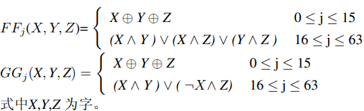

# SM3

采用多种优化方式，最终速度达到

## 算法描述

- IV =7380166f 4914b2b9 172442d7 da8a0600 a96f30bc 163138aa e38dee4d b0fb0e4e

#### 填充

假设消息m 的长度为l 比特。首先将比特“1”添加到消息的末尾，再添加k 个“0”，k是满 足l + 1 + k ≡ 448mod512 的最小的非负整数。然后再添加一个64位比特串，该比特串是长度l的二进 制表示。填充后的消息m′ 的比特长度为512的倍数。

#### 迭代过程

将填充后的消息m′按512比特进行分组：m′ = B(0)B(1) · · · B(n−1) 其中n=(l+k+65)/512。 对m′按下列方式迭代：

将消息分组B(i)按以下方法扩展生成132个字W0, W1, · · · , W67, W′ 0 , W′ 1 , · · · , W′ 63，用于压缩函 数CF：

#### 压缩函数

令A,B,C,D,E,F,G,H为字寄存器,SS1,SS2,TT1,TT2为中间变量,压缩函数V i+1 = CF(V (i) , B(i) ), 0 ≤ i ≤ n−1。计算过程描述如下：

#### 杂凑值

## 优化

#### 宏定义

利用宏定义减少函数创建，参数赋值等操作

#### 循环展开(开启O2会自动优化)

#### 预计算

同时采用了 杨先伟, 康红娟. SM3杂凑算法的软件快速实现研究[J]. 智能系统学报, 2015, 10(6): 954-959 中对压缩函数及消息扩展的优化。

## 效率

#### SM3 speed：188.694 MB/s

同时按照[官方文档]([302a3ada057c4a73830536d03e683110.pdf (oscca.gov.cn)](https://oscca.gov.cn/sca/xxgk/2010-12/17/1002389/files/302a3ada057c4a73830536d03e683110.pdf))中的实例检验了我们的实现结果是否正确。

## 参考文献

[1] 杨先伟, 康红娟. SM3杂凑算法的软件快速实现研究[J]. 智能系统学报, 2015, 10(6): 954-959

[2] [302a3ada057c4a73830536d03e683110.pdf (oscca.gov.cn)](https://oscca.gov.cn/sca/xxgk/2010-12/17/1002389/files/302a3ada057c4a73830536d03e683110.pdf)