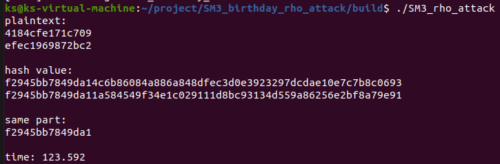

# implement the naïve birthday/rho attack of reduced SM3

利用生日攻击与rho完成了对SM3的攻击，最高完成了**64bit**的SM3碰撞


## 生日悖论

假如随机选择n个人，那么这n个人中有两个人的生日相同的概率是多少。如果要想概率是100%，那么只需要选择367个人就够了。因为只有366个生日日期（包括2月29日）。

如果想要概率达到99.9% ，那么只需要70个人就够了。50%的概率只需要23个人。


在项目中我们可以应用生日问题中的概率模型，从而减少碰撞攻击的复杂度


## birthday attack

首先计算大量SM3hash，然后再来判断有没有nbit的碰撞出现


通过循环来进行碰撞

## Rho attack

rho attack依赖于生日原理，通过生成随机序列来进行碰撞，由于最终会出现一个“环”，故称作rho算法

#### Floyd判环算法

Floyd判环算法又叫龟兔赛跑算法，是用差速转移的方式快速判断是否进入环的算法。

想象有一只兔子和一只乌龟按一个确定函数从同一个起点移动，兔子每次可以转移两次，乌龟可以转移一次，那么如果这个确定函数上没有环，那么兔子一定会在乌龟前面，二者一定不会相交；否则，由于函数上有环，兔子一定会“追上”乌龟，也就是“套圈”。

不仅如此，对算法分析可知，当兔子“追上”乌龟时，兔子也一定跑了刚好一圈

#### find_ring

find_ring函数用来寻找环，即循环节的出现，依赖于Floyd判环算法


核心代码，在循环中，一个hash一次，一个hash两次，即一个是另一个速度的两倍，如果检测到了相等，即发现了环的存在前。

#### find_collision

find_collision在找到环的基础上进行碰撞


依赖于生日悖论能显著降低复杂度

#### sm3.h sm3.cpp

hash函数使用自主实现的SM3

## 实验结果

实验最终完成了64bit的碰撞


##### 原像

- ce768f42af4f6dd9
- 23c83b83a7cf110e

##### Hash

- 1e2909041d6bddcaef1743d3e0a414fdo891fb06c7fc1e2ca7b2f99048e3fbc9
- 1e2909041d6bddca4136e2ecc2a691b9d3c0397ea4cbdf2de415698033169ef8

##### collsion

- 1e2909041d6bddca

## 效率分析

#### birthday attack

##### 24bit


##### 32bit


#### rho method

##### 48bit


##### 56bit




##### 64bit


## 运行指导

```
mkdir build&&cd build
make
```

