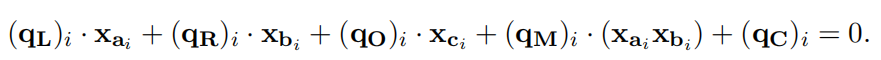
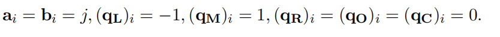
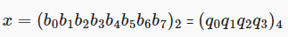
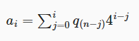
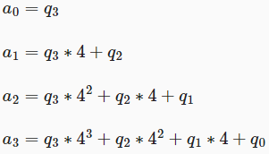
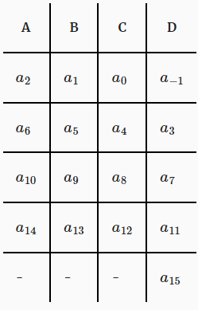

# Write a circuit to prove that your CET6 grade is larger than 425

将问题扩展到了任意范围，同时针对不同的约束系统进行了不同的电路结构设计。

## 电路构造

此处定义输入为n，要证明范围的bit数为k。

假设k=3

首先将n转化成二进制(记为 b0,b1,b2)

证明分为两步					

1. $$
   b_0*(b_0-1)=0\\b_1*(b_1-1)=0\\b_2*(b_2-1)=0
   $$

2. $$
   𝑏_0 + 2^1 ∗ 𝑏_1 + 2^2 ∗ 𝑏_2+2^3 ∗ 𝑏_3 − 𝑋 = 0
   $$

步骤一是为了证明b0,b1,b2为bool值

步骤二则证明n是一个kbit(此处为3）的数

由此我们便可零知识的证明n的范围为(0,2^n-1)，但此电路的局限性在于只能证明n的范围为(0,2^n-1），下面我们对该电路进行扩展。

## 扩展至任意范围

定义要证明的范围（min,max)

扩展即为对n进行一个处理
$$
a=max-n\\
b=n-min
$$
同时若为R1CS约束系统 还需添加(PLONK中不需要，PLONK引入了Copy constrains,可直接限制相应位置的值相等)
$$
a+b=n
$$
此式是为了限制a，b两式中的n为同一个n

然后对a和b分别进行上述的基本电路构造过程，由此我们便实现了任意范围的零知识证明

## R1CS（Groth16）

基础电路构造完成后，就是转化成约束的过程

R1CS（rank-1 constraint system）可将其理解为一个方程组，Prover需要向Verifier证明其知道满足该方程组所有方程式的解，证明过程可转化为Prover知道3组向量( a  , b , c ) 以及1组对应于R1CS解的向量s,使得
$$
<s,b>*<s,b>-<s,c>=0
$$

对于范围证明来说，n bit的证明需要n+1个约束，即若想证明某数属于（0,7）只需4个约束即可实现，可以看出R1CS还是相对比较高效的

但Groth16很大的一个弊端在于对于不同的电路实现要进行不同的“可信设置”，而trusted set up的消耗是很巨大的，而PLONK则克服了这一问题并提出了一种全新的约束系统

## PLONK

约束系统：

L 代表左输入，R 代表右输入，O 代表输出，M 代表乘法，C 代表常量。

加法门：
$$
q𝐿_𝑖 = 1，q𝑅_𝑖 = 1，q𝑀_𝑖 = 0，q𝑂_𝑖 = −1，q𝐶_𝑖 = 0
$$
乘法门：
$$
q𝐿_𝑖 = 0，q𝑅_𝑖 = 0，q𝑀_𝑖 = 1，q𝑂_𝑖 = −1，q𝐶_𝑖 = 0
$$
加法门：
$$
q𝐿_𝑖 = 1，q𝑅_𝑖 = 1，q𝑀_𝑖 = 0，q𝑂_𝑖 = −1，q𝐶_𝑖 = 0
$$
布尔门：

PLONK虽然只需一次可信设置，但其一个弊端就在于其约束系统，相同的证明相比于Groth16要更多，以此前提到的3bit的范围证明为例，PLONK需要10个门才能实现，PLONK的开发团队为了解决这一问题对此做出了改进。

## ULTRA PLONK

引入custom gate，即开发者可自主加入门。

在ULTRA PLONK的基础上重新进行电路的构建

此处我们以(0,2^8-1)为例

首先将其转化为4进制

即证明（0,4^4-1)

使用如下的表示方式

进行累加

得到一下式子

我们来观察上述4个式子
$$
a_1-4*a_0=q_2
$$
那么如果q2是一个4进制数，那么 
$$
a_1-4*a_0  \ \epsilon \ [0,1,2,3]
$$
这证明了q2是四进制数，同理可证明q0,q1,q3

那么如何证明
$$
a_{i+1}-4*a_i  \ \epsilon \ [0,1,2,3]
$$
和之前的思路类似
$$
b_0*(b_0-1)*(b_0-2)*(b_0-3)=0\\b_1*(b_1-1)*(b_1-2)*(b_1-3)=0\\b_2*(b_2-1)*(b_2-2)*(b_2-3)=0\\\\

其中b_i=a_{i+1}-4*a_i
$$

我们在basic PLONK的约束系统的基础上再引入一个selector polynomial D(x)

我们给出约束系统的全貌

在每个相邻项之间使用上述提到的约束。（即ai+1与ai）

这样我们只需5个门便完成了32bit的范围证明

即需要n/8-1个门

### inrange.circom

inrange.circom是用circom语言基于R1CS实现的电路